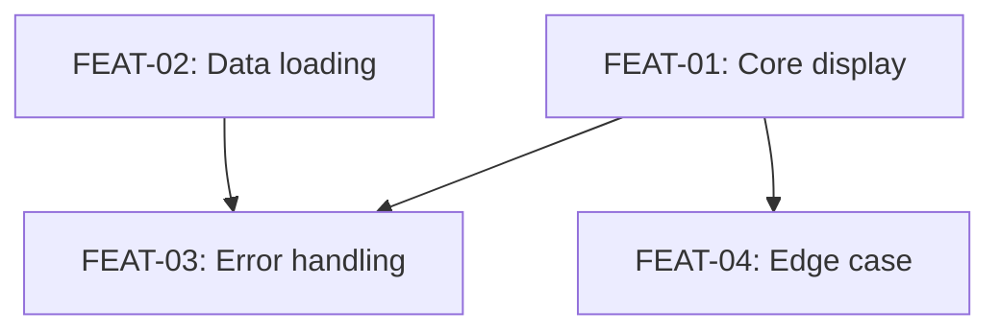

# Planning

*Chart the trail before others follow.*

## Overview

Planning wraps `superpowers:writing-plans` with structured task file creation. Each checkpoint becomes a machine-readable JSON file with dependencies, enabling enforcement during the build phase.

**Announce at start:** "I'm using the pathfinder:planning skill to create the implementation plan."

## Prerequisites

- `.pathfinder/state.json` exists with `phases.survey.status === "approved"`
- Survey gate file exists: `.pathfinder/survey.json`

<HARD-GATE>
If survey is not approved, REFUSE to plan. Invoke pathfinder:surveying first.
</HARD-GATE>

## The Process

### Step 1: Invoke Writing Plans

Follow `superpowers:writing-plans` completely:
- Break work into bite-sized tasks (2-5 minutes each)
- Every task has exact file paths, complete code approach, verification steps
- Emphasize TDD, YAGNI, DRY
- Save plan to `docs/plans/YYYY-MM-DD-<expedition-name>.md`

### Step 2: Identify Checkpoints

From the plan, extract checkpoints. Each checkpoint is a verifiable unit of work:
- **Happy Path** checkpoints: core functionality (no dependencies or depends on prior happy path)
- **Error/Edge Case** checkpoints: branch from happy path they test
- **Integration** checkpoints: depend on multiple happy path checkpoints

### Step 3: Create Task Files

For each checkpoint, create `.pathfinder/tasks/FEAT-XX.json`:

```bash
mkdir -p .pathfinder/tasks

cat > .pathfinder/tasks/FEAT-01.json << 'EOF'
{
  "id": "FEAT-01",
  "description": "Description of what this checkpoint verifies",
  "category": "Happy Path|Error Handling|Edge Case|Integration",
  "priority": "must|should|could",
  "status": "planned",
  "dependencies": [],
  "tests": {
    "e2e": [],
    "unit": []
  },
  "evidence": {
    "red": null,
    "green": null,
    "verified": null
  },
  "builderNotes": ""
}
EOF
```

**Naming convention:** Use expedition-specific prefixes (e.g., `WDASH-01` for weather-dashboard).

**Dependencies:** Array of checkpoint IDs that must be `green` or `verified` before this one can be built.

```json
{
  "id": "FEAT-03",
  "dependencies": ["FEAT-01", "FEAT-02"],
  "category": "Integration"
}
```

### Step 4: Create Plan Gate

```bash
cat > .pathfinder/plan.json << 'EOF'
{
  "status": "approved",
  "timestamp": "<ISO-8601>",
  "expedition": "<expedition-name>",
  "planFile": "docs/plans/YYYY-MM-DD-<expedition-name>.md",
  "checkpoints": [
    { "id": "FEAT-01", "description": "...", "dependencies": [] },
    { "id": "FEAT-02", "description": "...", "dependencies": ["FEAT-01"] }
  ]
}
EOF
```

### Step 5: Update State

```python
import json
state = json.load(open('.pathfinder/state.json'))
state['currentPhase'] = 'plan'
state['phases']['plan'] = {'status': 'approved', 'timestamp': '<ISO-8601>'}
state['checkpoints']['total'] = <number of tasks>
state['checkpoints']['planned'] = <number of tasks>
json.dump(state, open('.pathfinder/state.json', 'w'), indent=2)
```

### Step 6: Commit

```bash
git add .pathfinder/ docs/plans/
git commit -m "Plan: Chart trail for <expedition-name> (N checkpoints)"
```

### Step 7: Transition to Scouting

Announce: "Plan complete with N checkpoints. Ready for scouting — invoke `pathfinder:scouting` or say `/scout`."

## Dependency Graph

Present the dependency graph as a Mermaid diagram in the plan:



## Output

- `docs/plans/YYYY-MM-DD-<expedition-name>.md` — human-readable plan
- `.pathfinder/plan.json` — gate file with checkpoint summary
- `.pathfinder/tasks/FEAT-XX.json` — one per checkpoint (source of truth)
- Updated `.pathfinder/state.json`
